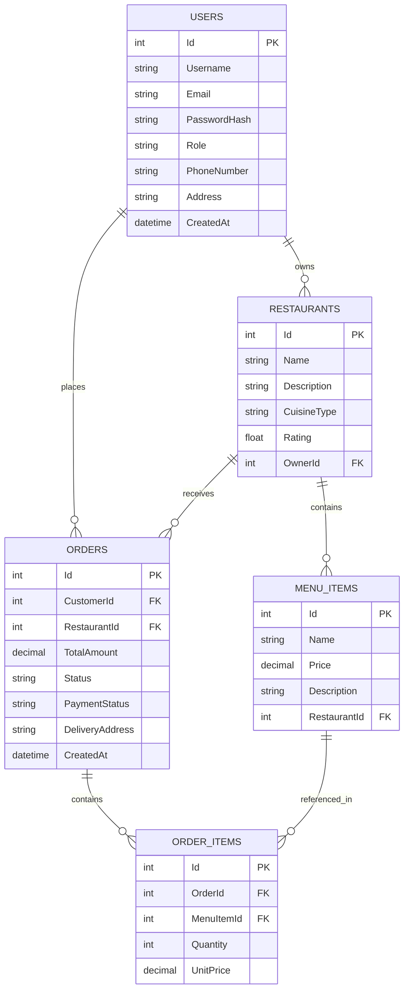

# 🚀 **Food Delivery API - Backend System**


**A complete, production-ready food delivery backend system built with ASP.NET Core Web API**

## 📋 **Table of Contents**
- [✨ Features](#-features)
- [🏗️ Architecture](#️-architecture)
- [📦 Prerequisites](#-prerequisites)
- [🚀 Installation](#-installation)
- [🔧 Configuration](#-configuration)
- [📁 Project Structure](#-project-structure)
- [🔗 API Endpoints](#-api-endpoints)
- [🗄️ Database Schema](#️-database-schema)
- [🧪 Testing](#-testing)
- [📱 Frontend Integration](#-frontend-integration)
- [🌐 Deployment](#-deployment)
- [🤝 Contributing](#-contributing)
- [📄 License](#-license)

## ✨ **Features**

### 🔐 **Authentication & Authorization**
- User registration with role-based system (Customer, Restaurant Owner, Admin)
- Secure login with password hashing using BCrypt
- JWT token-based authentication (ready to implement)
- Role-based access control

### 🍽️ **Restaurant Management**
- Complete CRUD operations for restaurants
- Menu item management
- Restaurant categorization by cuisine type
- Rating system

### 📦 **Order System**
- Create and manage food orders
- Real-time order status tracking (Pending → Preparing → Delivered → Canceled)
- Order history for customers
- Multi-item order support

### 👑 **Admin Dashboard**
- View all users, restaurants, and orders
- Administrative controls
- System monitoring
- Data management

### 🛠️ **Technical Features**
- Clean Architecture with separation of concerns
- Entity Framework Core with Code-First approach
- Repository and Service patterns
- DTO pattern for data transfer
- Swagger/OpenAPI documentation
- SQL Server/SQLite support
- Migration-based database updates

## 🏗️ **Architecture**

```
┌─────────────────────────────────────────────────────────────┐
│                     Presentation Layer                       │
│                    (Controllers & DTOs)                      │
└───────────────────────────┬─────────────────────────────────┘
                            │
┌───────────────────────────▼─────────────────────────────────┐
│                     Business Logic Layer                     │
│                    (Services & Interfaces)                   │
└───────────────────────────┬─────────────────────────────────┘
                            │
┌───────────────────────────▼─────────────────────────────────┐
│                     Data Access Layer                        │
│              (DbContext, Models & Repositories)              │
└───────────────────────────┬─────────────────────────────────┘
                            │
┌───────────────────────────▼─────────────────────────────────┐
│                     Database Layer                           │
│                  (SQL Server / SQLite)                       │
└─────────────────────────────────────────────────────────────┘
```

## 📦 **Prerequisites**

### **Required Software:**
- [.NET 8.0 SDK](https://dotnet.microsoft.com/download/dotnet/8.0)
- [Visual Studio 2022+](https://visualstudio.microsoft.com/) or [VS Code](https://code.visualstudio.com/)
- [SQL Server 2022](https://www.microsoft.com/en-us/sql-server/sql-server-downloads) or [SQLite](https://sqlite.org/index.html)
- [Git](https://git-scm.com/)

### **Optional:**
- [SQL Server Management Studio (SSMS)](https://docs.microsoft.com/en-us/sql/ssms/download-sql-server-management-studio-ssms)
- [Postman](https://www.postman.com/) or [Insomnia](https://insomnia.rest/) for API testing
- [Azure Data Studio](https://docs.microsoft.com/en-us/sql/azure-data-studio/download-azure-data-studio)

## 🚀 **Installation**

### **1. Clone the Repository**
```bash
git clone https://github.com/yourusername/FoodDeliveryAPI.git
cd FoodDeliveryAPI/backend
```

### **2. Restore Dependencies**
```bash
dotnet restore
```

### **3. Configure Database Connection**
Edit `appsettings.json`:
```json
{
  "ConnectionStrings": {
    "DefaultConnection": "Server=(localdb)\\MSSQLLocalDB;Database=FoodDeliveryDB;Trusted_Connection=True;MultipleActiveResultSets=true;TrustServerCertificate=True"
  }
}
```

### **4. Apply Database Migrations**
```bash
# Create database and tables
dotnet ef database update
```

### **5. Run the Application**
```bash
dotnet run
```

The API will be available at:
- **API:** `https://localhost:5212`
- **Swagger UI:** `https://localhost:5212/swagger`

## 🔧 **Configuration**

### **Environment Variables**
Create `.env` file or use `appsettings.Development.json`:

```json
{
  "Logging": {
    "LogLevel": {
      "Default": "Information",
      "Microsoft.AspNetCore": "Warning"
    }
  },
  "Jwt": {
    "Key": "YourSuperSecretKeyHere",
    "Issuer": "FoodDeliveryAPI",
    "Audience": "FoodDeliveryUsers"
  }
}
```

### **Database Options**
Choose your database:

**SQL Server (Production):**
```csharp
options.UseSqlServer(builder.Configuration.GetConnectionString("DefaultConnection"));
```

**SQLite (Development/Testing):**
```csharp
options.UseSqlite("Data Source=fooddelivery.db");
```

## 📁 **Project Structure**

```
Food_Delivery/
├── backend/                        # ASP.NET Core Web API
│   ├── Controllers/               # API Controllers
│   │   ├── AuthController.cs      # Authentication endpoints
│   │   ├── OrdersController.cs    # Order management
│   │   ├── RestaurantsController.cs # Restaurant management
│   │   └── AdminController.cs     # Admin endpoints
│   │
│   ├── Data/                      # Data Access Layer
│   │   └── ApplicationDbContext.cs # Database context
│   │
│   ├── DTOs/                      # Data Transfer Objects
│   │   ├── Auth/
│   │   │   ├── LoginDto.cs
│   │   │   └── RegisterDto.cs
│   │   ├── Orders/
│   │   │   ├── OrderDto.cs
│   │   │   ├── CreateOrderDto.cs
│   │   │   └── OrderItemDto.cs
│   │   └── Restaurants/
│   │       ├── RestaurantDto.cs
│   │       ├── MenuItemDto.cs
│   │       └── CreateRestaurantDto.cs
│   │
│   ├── Models/                    # Database Entities
│   │   ├── User.cs               # User entity
│   │   ├── Restaurant.cs         # Restaurant entity
│   │   ├── MenuItem.cs           # Menu item entity
│   │   ├── Order.cs              # Order entity
│   │   └── OrderItem.cs          # Order item entity
│   │
│   ├── Services/                  # Business Logic Layer
│   │   ├── IAuthService.cs       # Auth service interface
│   │   ├── AuthService.cs        # Auth service implementation
│   │   ├── IOrderService.cs      # Order service interface
│   │   ├── OrderService.cs       # Order service implementation
│   │   ├── IRestaurantService.cs # Restaurant service interface
│   │   └── RestaurantService.cs  # Restaurant service implementation
│   │
│   ├── Migrations/               # EF Core migrations
│   ├── Properties/               # Launch settings
│   ├── appsettings.json         # Configuration
│   └── Program.cs               # Application entry point
│
└── frontend/                     # React Frontend (To be implemented)
    ├── public/
    └── src/
        ├── components/          # React components
        ├── pages/              # Page components
        ├── services/           # API service calls
        └── App.js              # Main application component
```

## 🔗 **API Endpoints**

### **🔐 Authentication**
| Method | Endpoint | Description | Auth Required |
|--------|----------|-------------|---------------|
| POST | `/api/auth/register` | Register new user | No |
| POST | `/api/auth/login` | User login | No |

### **🍽️ Restaurants**
| Method | Endpoint | Description | Auth Required |
|--------|----------|-------------|---------------|
| GET | `/api/restaurants` | Get all restaurants | No |
| GET | `/api/restaurants/{id}` | Get restaurant by ID | No |
| POST | `/api/restaurants` | Create restaurant | Yes (Owner/Admin) |
| PUT | `/api/restaurants/{id}` | Update restaurant | Yes (Owner/Admin) |
| DELETE | `/api/restaurants/{id}` | Delete restaurant | Yes (Owner/Admin) |

### **📦 Orders**
| Method | Endpoint | Description | Auth Required |
|--------|----------|-------------|---------------|
| POST | `/api/orders` | Create new order | Yes (Customer) |
| GET | `/api/orders/customer/{customerId}` | Get customer orders | Yes (Customer/Owner) |
| GET | `/api/orders/{id}` | Get order by ID | Yes |
| PUT | `/api/orders/{id}/cancel` | Cancel order | Yes (Customer) |
| GET | `/api/orders` | Get all orders | Yes (Admin) |

### **👑 Admin**
| Method | Endpoint | Description | Auth Required | Role |
|--------|----------|-------------|---------------|------|
| GET | `/api/admin/users` | Get all users | Yes | Admin |
| GET | `/api/admin/restaurants` | Get all restaurants | Yes | Admin |
| GET | `/api/admin/orders` | Get all orders | Yes | Admin |
| DELETE | `/api/admin/users/{id}` | Delete user | Yes | Admin |
| DELETE | `/api/admin/restaurants/{id}` | Delete restaurant | Yes | Admin |

## 🗄️ **Database Schema**



## 🧪 **Testing**

### **Using Swagger UI**
1. Navigate to `https://localhost:5212/swagger`
2. Click on any endpoint
3. Click "Try it out"
4. Enter required parameters
5. Click "Execute"

### **Sample API Requests**

**Register User:**
```bash
curl -X POST "https://localhost:5212/api/auth/register" \
  -H "Content-Type: application/json" \
  -d '{
    "username": "john_doe",
    "email": "john@example.com",
    "password": "Password123",
    "role": "Customer"
  }'
```

**Create Order:**
```bash
curl -X POST "https://localhost:5212/api/orders" \
  -H "Content-Type: application/json" \
  -d '{
    "customerId": 1,
    "restaurantId": 1,
    "deliveryAddress": "123 Main St, City",
    "items": [
      {
        "menuItemId": 1,
        "quantity": 2
      }
    ]
  }'
```

## 📱 **Frontend Integration**

### **React Frontend Setup**
```bash
# Create React app
npx create-react-app frontend
cd frontend

# Install required packages
npm install axios react-router-dom bootstrap react-bootstrap
```

### **Sample React Service (API calls)**

**Create `src/services/api.js`:**
```javascript
import axios from 'axios';

const API_BASE_URL = 'https://localhost:5212/api';

const api = axios.create({
  baseURL: API_BASE_URL,
  headers: {
    'Content-Type': 'application/json',
  },
});

// Add token to requests if available
api.interceptors.request.use((config) => {
  const token = localStorage.getItem('token');
  if (token) {
    config.headers.Authorization = `Bearer ${token}`;
  }
  return config;
});

// Authentication Services
export const authService = {
  register: (userData) => api.post('/auth/register', userData),
  login: (credentials) => api.post('/auth/login', credentials),
};

// Restaurant Services
export const restaurantService = {
  getAll: () => api.get('/restaurants'),
  getById: (id) => api.get(`/restaurants/${id}`),
  create: (restaurantData) => api.post('/restaurants', restaurantData),
  update: (id, restaurantData) => api.put(`/restaurants/${id}`, restaurantData),
  delete: (id) => api.delete(`/restaurants/${id}`),
};

// Order Services
export const orderService = {
  create: (orderData) => api.post('/orders', orderData),
  getCustomerOrders: (customerId) => api.get(`/orders/customer/${customerId}`),
  getById: (id) => api.get(`/orders/${id}`),
  cancel: (id) => api.put(`/orders/${id}/cancel`),
};

export default api;
```

### **Sample React Component**
**Create `src/components/RestaurantList.js`:**
```jsx
import React, { useState, useEffect } from 'react';
import { restaurantService } from '../services/api';

function RestaurantList() {
  const [restaurants, setRestaurants] = useState([]);
  const [loading, setLoading] = useState(true);

  useEffect(() => {
    fetchRestaurants();
  }, []);

  const fetchRestaurants = async () => {
    try {
      const response = await restaurantService.getAll();
      setRestaurants(response.data);
    } catch (error) {
      console.error('Error fetching restaurants:', error);
    } finally {
      setLoading(false);
    }
  };

  if (loading) return <div>Loading...</div>;

  return (
    <div className="restaurant-list">
      <h2>Restaurants</h2>
      <div className="row">
        {restaurants.map((restaurant) => (
          <div key={restaurant.id} className="col-md-4 mb-4">
            <div className="card">
              <div className="card-body">
                <h5 className="card-title">{restaurant.name}</h5>
                <p className="card-text">{restaurant.description}</p>
                <p className="card-text">
                  <small className="text-muted">{restaurant.cuisineType}</small>
                </p>
                <p className="card-text">
                  ⭐ {restaurant.rating}/5
                </p>
              </div>
            </div>
          </div>
        ))}
      </div>
    </div>
  );
}

export default RestaurantList;
```

## 🌐 **Deployment**

### **Deploy to Azure**
```bash
# Publish to Azure App Service
az webapp up --name FoodDeliveryAPI --resource-group YourResourceGroup
```

### **Docker Deployment**
```dockerfile
# Dockerfile
FROM mcr.microsoft.com/dotnet/aspnet:8.0 AS base
WORKDIR /app
EXPOSE 80
EXPOSE 443

FROM mcr.microsoft.com/dotnet/sdk:8.0 AS build
WORKDIR /src
COPY ["FoodDeliveryAPI.csproj", "."]
RUN dotnet restore
COPY . .
RUN dotnet build -c Release -o /app/build

FROM build AS publish
RUN dotnet publish -c Release -o /app/publish

FROM base AS final
WORKDIR /app
COPY --from=publish /app/publish .
ENTRYPOINT ["dotnet", "FoodDeliveryAPI.dll"]
```

## 🤝 **Contributing**

### **Development Workflow**
1. Fork the repository
2. Create a feature branch (`git checkout -b feature/AmazingFeature`)
3. Commit your changes (`git commit -m 'Add some AmazingFeature'`)
4. Push to the branch (`git push origin feature/AmazingFeature`)
5. Open a Pull Request

### **Code Standards**
- Follow C# coding conventions
- Use meaningful variable and method names
- Add XML comments for public methods
- Write unit tests for new features
- Update documentation accordingly

## 📄 **License**

This project is licensed under the MIT License - see the [LICENSE](LICENSE) file for details.

## **Acknowledgments**

- [ASP.NET Core Documentation](https://docs.microsoft.com/en-us/aspnet/core/)
- [Entity Framework Core](https://docs.microsoft.com/en-us/ef/core/)
- [React Documentation](https://reactjs.org/docs/getting-started.html)
- [Swagger/OpenAPI](https://swagger.io/)

## 📞 **Support**

For support, email  mlayan775@gmail.com or create an issue in the GitHub repository.

---

**Made with ❤️ by [Layan Buirat]**

⭐ **If you found this project helpful, please give it a star on GitHub!** ⭐
# food-delivery-ApI-ASP.NET

